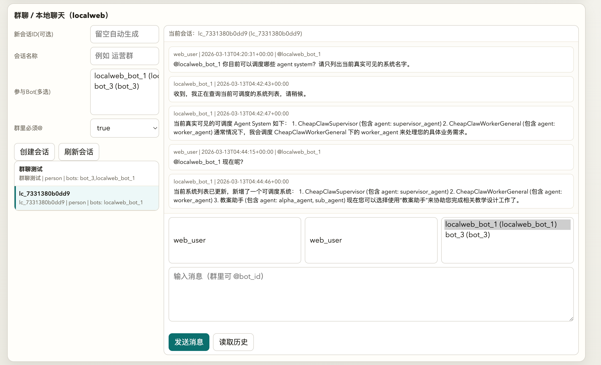
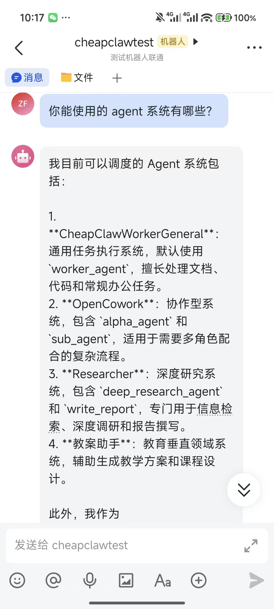
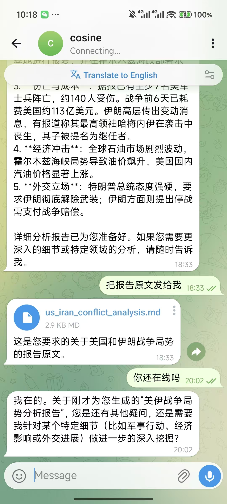

<p align="center">
  
</p>

<p align="center">
  <a href="README.md">English</a> | 简体中文
</p>

# CheapClaw

CheapClaw 是一个基于 `infiagent` SDK 构建的多 Bot 调度应用。

## 项目简介

CheapClaw 的初衷是“笔者看着自己 OpenClaw 的 token 账单感到心痛”。因此，CheapClaw 在满足 OpenClaw 大部分功能的情况下，进一步扩展了部分能力，同时提升了相同模型处理复杂问题时的稳定性和性价比。

达成这一效果的核心差异，在于单个 agent loop 内强弱模型的混合执行。在 OpenClaw 中，可以依靠不同 bot 的分工，让强模型 bot 负责规划、弱模型 bot 负责执行；但执行 bot 有一个明显问题，如果任务执行过程没有按规划预期推进，弱模型往往会崩溃。基于 infiagent SDK 的特性，在同一个 agent loop 中，它会阶段式地思考，并且周期性截断之前的大段对话（例如每 10 步或 20 步），这不仅让小模型始终在更短的上下文中执行，也让来自强模型的计划可以持续得到实时修正。

所以，虽然 CheapClaw 回复一句“你好”时，和 OpenClaw 一样也要经过完整流程，但在更复杂的任务上，比如：

- “总结某个列表下 500 个 PDF 的内容到一个表格”
- “完成一份至少 100 页的 EV 调研报告”

这种细粒度的混合执行会明显节省你的成本。

除此之外，CheapClaw 还支持一些新的特性，允许用户通过改造提升垂类任务的稳定性：

- 除了 skills 外，可以给 bot 添加完整的智能体系统供其调用，支持自定义的单智能体或多智能体系统，也支持自定义工具。这样可以通过自己或他人的垂类智能体，更可靠地完成复杂任务，例如科学研究、论文撰写。具体使用方式可以查看文档内教程。
- 完全拆分的分层记忆。bot 的调度智能体只维护与用户的交互记忆；它调度的子智能体系统只维护同一个任务下、同一类任务的记忆，不会被其他类型任务的噪声干扰。
- 用户可以基于 infiagent 项目的说明，通过配置文件编辑出自己的智能体系统，并添加到对应 bot 下。（注意不要给这些智能体系统启用内置的 `human_in_loop` 工具。）


## 核心能力

- 多个 Bot 共享一套 LLM 配置。
- 可以先从内置网页聊天启动，再逐步接入 Telegram、飞书等渠道。
- Supervisor 能自动判断一条新消息应该：
  - 直接回复
  - 继续旧 `task_id`
  - 追加到正在运行的任务
  - 新开一个任务分支
- 支持把自定义 Agent System 作为 zip 包安装进去。
- 自带统一 Dashboard，可用于配置、监控、本地聊天和群聊。

## 安装

### 从 PyPI 安装

```bash
python -m pip install -U cheapclaw
```

### 从源码安装

```bash
git clone https://github.com/polyuiislab/CheapClaw.git
cd CheapClaw
python -m pip install -U -e .
```

## 快速开始

### 方案 A：正常首次配置

```bash
cheapclaw config --interactive
cheapclaw up
```

启动后打开：

```text
http://127.0.0.1:8787/dashboard
```

### 方案 B：先生成模板

```bash
cheapclaw init
cheapclaw config --interactive
cheapclaw up
```

`cheapclaw init` 会在默认位置生成 `fleet.manifest.json` 模板。

## 默认目录

CheapClaw 默认把运行文件放在：

```text
~/cheapclaw
```

最常用的几个路径是：

```text
~/cheapclaw/fleet.manifest.json
~/cheapclaw/runtime
~/cheapclaw/runtime/config/llm_config.yaml
```

大多数 CLI 命令都会自动使用这个默认 manifest，所以一般不需要手动传 `--manifest`。

## 如果你只有一个 API Key 和一个 Base URL

这已经足够。

在 `cheapclaw config --interactive` 中填写：

- `llm.base_url`
- `llm.api_key`
- `llm.model`

CheapClaw 会生成一份共享的 `llm_config.yaml`，默认所有 Bot 都共用它。

### 关于 `llm.model` 应该怎么填

这里之前最容易让人误解，所以我直接写结论：

对于 InfiAgent 风格的模型名，**推荐直接填写完整模型标识**。

例如：

- `openai/gpt-4o`
- `openai/google/gemini-3-flash-preview`
- 某些部署里也可能是 `openrouter/openai/gpt-4o`

也就是说，通常要把“API 格式前缀”写在模型名前面。

交互配置的当前行为是：

- 如果你输入的是裸模型名，例如 `gpt-4o`，CheapClaw 会自动补成 `openai/gpt-4o`
- 如果你输入的值本来就带前缀，例如 `openai/gpt-4o` 或 `openrouter/openai/gpt-4o`，CheapClaw 会原样保留，不会重复拼接

## 推荐的第一次使用路径

如果你第一次部署 CheapClaw，最稳的路径是：

1. 先建一个 `localweb` Bot
2. 启动 CheapClaw
3. 打开 Dashboard，确认网页聊天能正常回复
4. 再去接 Telegram 或飞书

这样可以避免第一次就同时排查：

- LLM 配置
- 渠道凭据
- 网络代理
- 平台权限

## Dashboard

内置控制台地址：

```text
http://127.0.0.1:8787/dashboard
```

在这个页面里你可以：

- 查看所有 Bot
- 看运行状态
- 编辑 Fleet 配置
- 使用本地网页聊天
- 创建多 Bot 群聊
- 查看历史记录
- 管理运行时而不必手动改文件

### 在服务器上开放 Dashboard

如果要给局域网或远程机器访问：

```bash
cheapclaw up --web-host 0.0.0.0 --web-port 8787
```

然后通过：

```text
http://<服务器IP>:8787/dashboard
```

访问。

### Dashboard 示例



这个截图展示的是：通过 CLI 安装了额外的自定义 Agent System 之后，Bot 的调度能力从内置系统扩展到了更多系统。

## 添加 Bot

你可以通过两种方式添加 Bot：

- Dashboard
- CLI

### 用 CLI 添加 Bot

```bash
cheapclaw add-bot
```

这个命令是交互式的，会依次问你：

- bot id
- display name
- channel 类型
- 凭据
- 是否立即启动

### 单独管理一个 Bot

```bash
cheapclaw start-bot --bot-id bot_1
cheapclaw stop-bot --bot-id bot_1
cheapclaw reload-bot --bot-id bot_1 --prepare-first
```

### 查看 Bot 状态

```bash
cheapclaw list-bots
cheapclaw status
cheapclaw status --bot-id bot_1
cheapclaw logs --bot-id bot_1
```

## 本地网页聊天（localweb）

`localweb` 是最适合第一次测试的渠道，因为它不需要任何第三方凭据。

适用场景：

- 首次验证
- 本地调试
- 演示
- 多 Bot 群聊实验

在 localweb 群聊里：

- 可以把多个 localweb Bot 放进一个会话
- `@bot_id` 会把消息路由给对应 Bot
- 如果一条消息里提到了一个或多个 Bot，那么只有被提到的 Bot 会被触发

## 连接 Telegram

准备：

- 一个 `@BotFather` 创建的 Bot Token
- 可选的 `allowed_chats`

在 `cheapclaw config --interactive` 或 `cheapclaw add-bot` 中：

- 选择 `telegram`
- 填 `telegram.bot_token`
- 如有需要，填 `telegram.allowed_chats`

启动：

```bash
cheapclaw start-bot --bot-id telegram_bot_1 --prepare-first
```

如果 Telegram 轮询报 `404 getUpdates`，通常就是 token 错了或格式不对。

## 连接飞书

准备：

- `app_id`
- `app_secret`

配置时：

- 选择 `feishu`
- 填 `feishu.app_id`
- 填 `feishu.app_secret`

CheapClaw 默认使用飞书长连接模式。

如果你的环境有代理，记得确认 CheapClaw 实际读取到的是你希望它使用的代理配置。

## 其他渠道

当前还支持：

- Discord
- WhatsApp Cloud API
- QQ（通过 OneBot v11 bridge）
- WeChat（通过 OneBot v11 bridge）

但对大多数用户来说，依然建议先跑通：

1. `localweb`
2. Telegram 或飞书

再接桥接型渠道。

## 安装自定义 Agent System

CheapClaw 支持把完整 Agent System 作为 zip 安装进去。

安装到单个 Bot：

```bash
cheapclaw bot-agent-system add "/path/to/agent_system.zip" --bot-id bot_1
```

安装后立刻重载：

```bash
cheapclaw bot-agent-system add "/path/to/agent_system.zip" --bot-id bot_1 --reload-after
```

安装到全局共享 assets：

```bash
cheapclaw bot-agent-system add "/path/to/agent_system.zip" --global
```

说明：

- `--bot-id` 只安装到该 Bot 的 runtime
- `--reload-after` 会立刻重启这个 Bot，使新系统马上可见
- 运行时安装的系统在正常 `prepare / reload` 流程中会被保留，不会被自动删掉

## 常用命令

### 主流程

```bash
cheapclaw init
cheapclaw config --interactive
cheapclaw prepare
cheapclaw up
cheapclaw stop
cheapclaw restart
```

### 单 Bot 控制

```bash
cheapclaw add-bot
cheapclaw start-bot --bot-id bot_1
cheapclaw stop-bot --bot-id bot_1
cheapclaw reload-bot --bot-id bot_1 --prepare-first
```

### 状态和日志

```bash
cheapclaw list-bots
cheapclaw status
cheapclaw status --bot-id bot_1
cheapclaw logs --bot-id bot_1
```

### Dashboard 控制

```bash
cheapclaw web-start
cheapclaw web-stop
cheapclaw web-status
```

### Agent System 管理

```bash
cheapclaw bot-agent-system add "/path/to/agent_system.zip" --bot-id bot_1
cheapclaw bot-agent-system add "/path/to/agent_system.zip" --bot-id bot_1 --reload-after
cheapclaw bot-agent-system add "/path/to/agent_system.zip" --global
```

## 使用案例

### 手机端接入：飞书 + Telegram

下面两张图展示的是 CheapClaw 接入手机聊天渠道后的效果。

| 飞书 | Telegram |
|---|---|
|  |  |

这是一个非常实用的部署方式：

- 调度逻辑运行在你的服务器上
- 用户仍然在熟悉的聊天软件里和系统交互
- Supervisor 负责决定该复用旧任务还是新开分支

### 网页控制台 + 扩展 Agent System


这个场景展示的是：一个最初只有内置系统的 Bot，后来通过 CLI 安装了额外系统，于是调度能力随之扩展。

## 注意事项

### 1. Watchdog 默认是低频的

当前默认值：

```text
watchdog_interval_sec = 86400
```

也就是 24 小时。

这样可以减少维护噪音。如果你确实需要更短的周期，可以在初始化后改：

```text
~/cheapclaw/runtime/<bot_id>/cheapclaw/config/app_config.json
```

### 2. `system-add.md` 现在是可共存的

CheapClaw 只会更新 `system-add.md` 里自己的保留区块。

所以现在：

- 你可以在区块外写自己的提示
- 智能体也可以把简短经验和用户偏好记录进去
- CheapClaw 不会整文件覆盖

### 3. 删除 runtime 之前先停服务

先执行：

```bash
cheapclaw stop
```

再去删 runtime 或改里面的文件。

### 4. Agent System 可见性是基于 runtime 的

CheapClaw 只会暴露当前 Bot runtime 里实际存在的 Agent System。

也就是说：

- `infiagent` 自带系统不会自动注入
- Bot 只会看到你明确准备或安装进去的系统

### 5. 出问题时先回到 `localweb`

如果某个社交渠道不响应，先验证：

- Dashboard 能打开
- localweb Bot 能回复
- LLM 配置是有效的

再继续查 Telegram 或飞书配置。

## 仓库结构

```text
assets/                    内置配置、Agent System、截图
docs/                      补充文档
scripts/                   CLI 和 Dashboard 启动逻辑
tools_library/             CheapClaw 运行时工具
web/                       Dashboard 前端文件
cheapclaw_service.py       主服务循环
README.md                  英文说明
README.zh-CN.md            中文说明
```

## 补充文档

- [English README](README.md)
- [中文 CLI 教程](docs/CHEAPCLAW_CLI_TUTORIAL_ZH.md)
- [SDK 指南](SDK_GUIDE.md)
